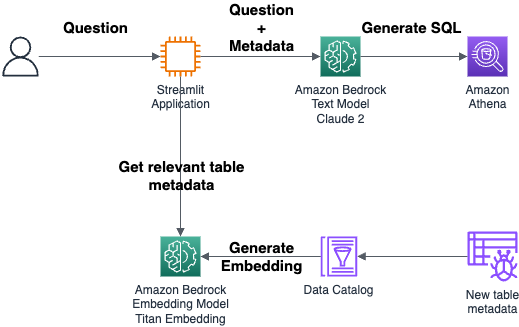

# <font color="violet">AWS Glue</font> Data Catalog Text-to-SQL 👾

**AWS Glue Data Catalog Text-to-SQL** is a plug-and-play Generative AI application that that integrates with your Glue Data Catalog to enhance table search as well as SQL Query generation. It enables data analysts, data scientists, and data users to enhance their productivity and to find the right datasets for their use cases and data products.



## Prerequisites
### Region
This code should run in the **region** where
- Your Glue Data Catalog is hosted
- Amazon Bedrock is generally available 

### Python version
This code has been tested with python3.8.

If you are on Amazon Linux and do not have python>=3.8, install it:
```
sudo yum remove python3.7
sudo yum install -y amazon-linux-extras
sudo amazon-linux-extras enable python3.8
sudo yum install python3.8
```
You might need to fix pip before the Installation step:
```
curl -O https://bootstrap.pypa.io/get-pip.py
python3.8 get-pip.py --user
```

## Installation
Install dependencies needed
```bash
pip install -r requirements.txt
```

Troubleshooting: if this pip install fails, please check that the versions of the downloaded libraries matches the versions in the pip install. If it does not match, please fix the versions in the pip install.

## Configuration

Using **Opensearch** as a Vector Store is entirely **optional**. You can use a local FAISS implementation.

If you are using **Opensearch** as a Vector Store, please configure the domain's name and its corresponding endpoint in the ```config.py``` file

> ⚠️ **Warning:** At this time, the sample supports Amazon Opensearch service's provisioned version

## Usage

Run the streamlit app

``` bash
streamlit run app.py --server.port <PORT_TO_USE>
```

## Security

See [CONTRIBUTING](CONTRIBUTING.md#security-issue-notifications) for more information.

## License

This library is licensed under the MIT-0 License. See the LICENSE file.